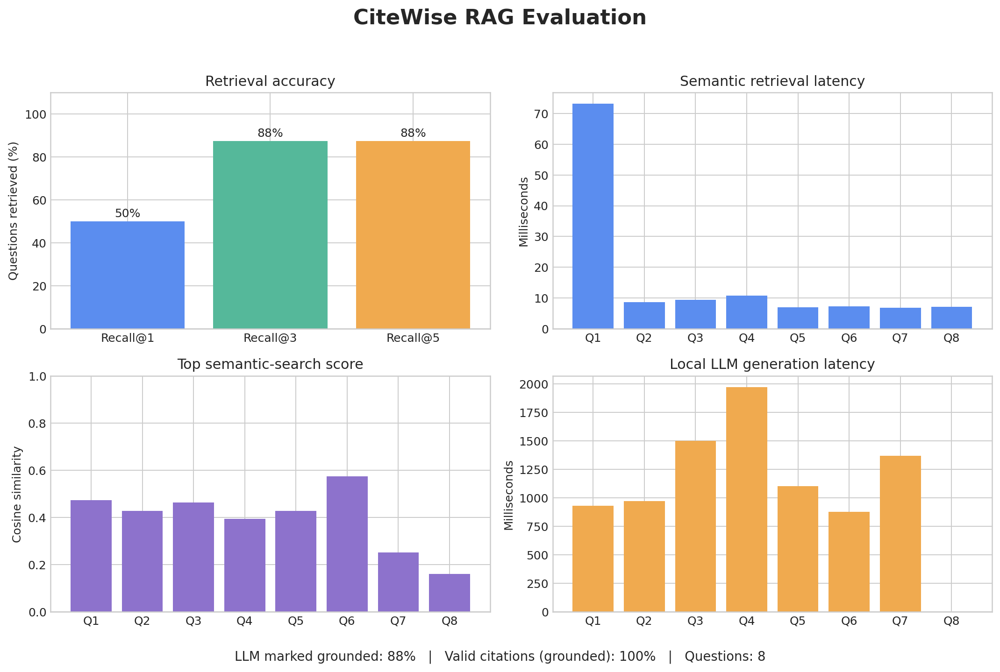

# CiteWise

An evidence-first PDF research assistant built by **Luka Zotovikj**. CiteWise retrieves passages by
meaning, preserves page-level provenance, and abstains when uploaded documents
do not provide sufficient evidence.

## Why this project

Many chat-with-PDF demos hide weak retrieval behind fluent output. CiteWise
makes retrieval observable: every result includes its source, page, passage,
and similarity score. It works locally without a paid API key.

## Features

- Upload and index multiple text-based PDFs
- Local semantic embeddings with all-MiniLM-L6-v2
- Hybrid retrieval for semantic meaning plus exact technical terms
- Overlapping, page-aware chunks with traceable citations
- Ranked top-k retrieval and insufficient-evidence abstention
- Free local answer generation through Ollama and Qwen3
- Structured LLM output with validated source references
- FastAPI validation, file limits, OpenAPI docs, and health endpoint
- Responsive React and TypeScript interface
- Unit tests, GitHub Actions CI, and a multi-stage Docker build
- Retrieval benchmark comparing two chunking strategies

## Architecture

    PDF upload
        |
        v
    pypdf extraction -> page-aware chunks -> MiniLM embeddings
                                                |
    Question -> query embedding -> hybrid search
                                   |
                                   v
                         local Ollama LLM
                                   |
                                   v
                          answer + citations
                                   |
                                   v
                            React interface

The MVP performs vector search with NumPy and persists document metadata,
chunks, and embeddings in SQLite. The storage logic is isolated behind one
class so PostgreSQL with pgvector can replace it without changing the API or UI.

## Local development

Requirements: Python 3.10+, Node.js 20+, and Ollama.

    python3 -m venv .venv
    source .venv/bin/activate
    pip install -e '.[dev]'
    cd frontend
    npm install

Install Ollama using the instructions for your operating system, then download
the default model:

    ollama pull qwen3:1.7b

Keep Ollama running. Its local API uses http://localhost:11434 and does not
require an account, API key, or per-request payment.

Start these in separate terminals from the repository root:

    uvicorn rag_assistant.api:app --reload

    cd frontend
    npm run dev

Open http://localhost:5173. API documentation is at http://localhost:8000/docs.

Configuration is optional; the defaults work for the recommended model:

    OLLAMA_BASE_URL=http://localhost:11434
    OLLAMA_MODEL=qwen3:1.7b
    CITEWISE_DB_PATH=data/citewise.db

## Quality checks

    pytest -q
    HF_HUB_OFFLINE=1 python -m rag_assistant.benchmark
    cd frontend && npm run build

| Chunking strategy | Recall@1 | Recall@3 |
|---|---:|---:|
| Fixed word windows | 67% | 100% |
| Paragraph-aware | 100% | 100% |

The six-question benchmark demonstrates the evaluation method; it is not a
claim that one strategy wins across arbitrary corpora.

### Generate plot-ready evaluation data

The experiment runner evaluates retrieval and local generation, then writes one
CSV row per question with Recall@k flags, retrieval latency, generation
latency, grounding status, citation validity, scores, and generated text:

    python scripts/evaluate_rag.py \
      ../ecg-model-compression/deliverables/report/ECG_Model_Compression_Report.pdf

Use --skip-generation to benchmark retrieval without starting Ollama. The
labeled questions live in evaluation/ecg_questions.json and the generated CSV
is written to results/rag_evaluation.csv.

Create the visual evaluation dashboard after generating the CSV:

    python scripts/plot_evaluation.py

The chart is saved to `results/evaluation_dashboard.png` and summarizes
Recall@k, retrieval latency, similarity scores, generation latency, grounding,
and citation validity.

### Recorded ECG report results

The repository includes one reproducible run over eight hand-labeled questions
about the accompanying ECG project report:

| Metric | Result |
|---|---:|
| Recall@1 | 50.0% (4/8) |
| Recall@3 | 87.5% (7/8) |
| Recall@5 | 87.5% (7/8) |
| Answers marked grounded by the LLM | 87.5% (7/8) |
| Structurally valid citations on grounded answers | 100% (7/7) |

These are baseline results from a small, project-specific dataset, not a claim
of general RAG accuracy. Citation validity means cited pages came from the
retrieved context; it does not by itself prove that every generated statement
is correct. The CSV intentionally exposes weak cases: one expected page was
not found in the top five, and one question caused the system to abstain. This
makes retrieval and answer-quality improvements measurable rather than hidden.

## Docker

    docker compose up --build

Then open http://localhost:8000.

## API

| Method | Path | Purpose |
|---|---|---|
| GET | /api/health | API health and local-model readiness |
| GET | /api/documents | List indexed PDFs |
| POST | /api/documents | Upload and index a PDF |
| DELETE | /api/documents/{id} | Remove a PDF |
| POST | /api/questions | Generate an evidence-grounded answer with citations |

## Engineering decisions

- Local embeddings keep document content private and search reproducible.
- Normalized embeddings turn cosine similarity into a fast dot product.
- A lightweight lexical score improves acronyms, numbers, and model names.
- Page-aware chunks never cross page boundaries, preserving valid citations.
- Dependency injection lets tests use deterministic fake embeddings.
- Weak matches produce an explicit insufficient-evidence response.
- SQLite avoids re-embedding every PDF after a local server restart.
- Ollama keeps generation local, free, and replaceable through configuration.
- Structured JSON output is validated before citations reach the interface.

## What I learned

- How embeddings represent semantic meaning and enable cosine search
- Why chunk size, overlap, and page boundaries affect retrieval quality
- How to retain provenance from PDF ingestion through the final API response
- How dependency injection makes ML-backed code fast and deterministic to test
- How a React client, FastAPI service, and local ML model fit together
- Why retrieval must be evaluated separately from generated answer quality

## Limitations and roadmap

- NumPy search is intended for a local corpus; migrate to PostgreSQL and
  pgvector for concurrent users and a larger collection.
- Improve Recall@1 by evaluating reranking and chunk-boundary strategies.
- Add OCR for image-only scanned papers.
- Expand evaluation to a held-out multi-document dataset and report latency.

The learning directory records the from-first-principles exercises. Production
code lives in src.
